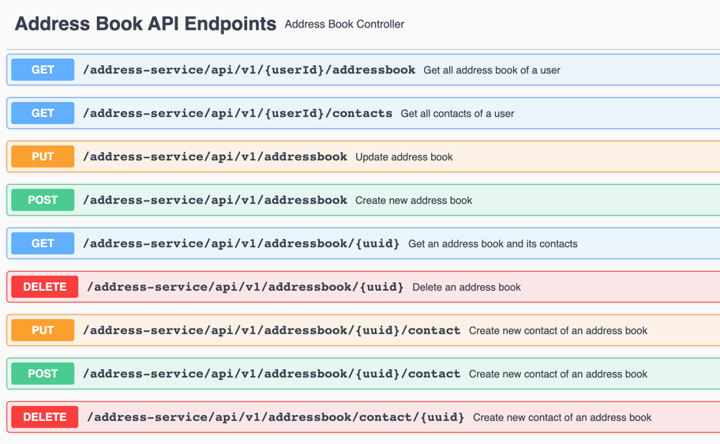

# Getting Started

### Build docker image
./gradlew buildDockerImages

### Run the application
docker run -d -p 9080:9080 demo/address-service

### List address book of user u0001

curl --location --request GET 'http://localhost:9080/address-service/api/v1/u0001/addressbook' \
--header 'Content-Type: application/json' \
--data-raw '    {
"id": "ba346384-cba5-4538-a901-8c5401f7de35",
"firstName": "Will",
"lastName": "Fry",
"phoneNumber": "0400123123"
}'

### Swagger
http://localhost:9080/address-service/swagger-ui/

